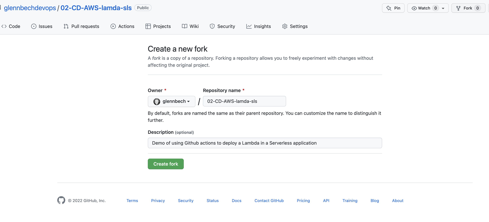
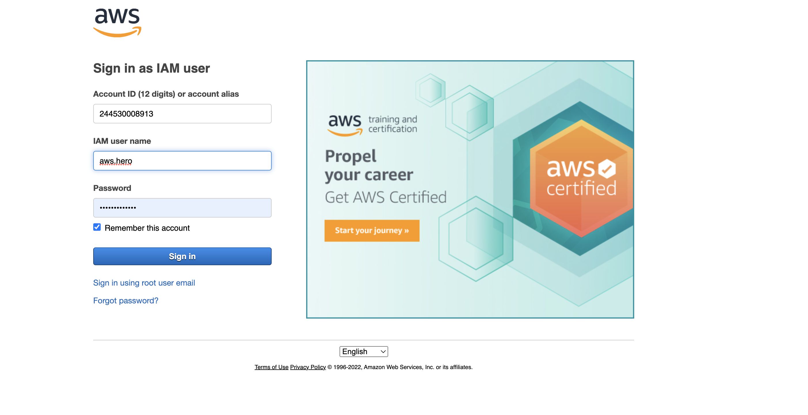
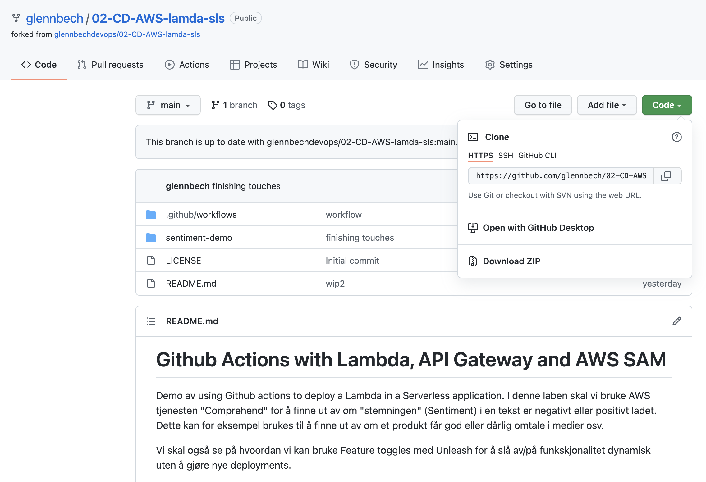

# Github Actions with Lambda, API Gateway and AWS SAM

Demo av Github actions, og hvordan vi kan sette opp en CD pipeline for en AWS Lambdafunksjon. I denne laben skal vi bruke 
AWS tjenesten "Comprehend" for å finne ut av om "stemningen" (Sentiment) i en tekst er negativt eller positivt 
ladet. Dette kan for eksempel brukes til å finne ut av om et produkt får god eller dårlig omtale i medier osv. 

Vi skal også se på hvoordan vi kan bruke Feature toggles med Unleash for å slå av/på funkskjonalitet dynamisk 
uten å gjøre nye deployments. 

Vi skal også se på verktøyet "AWS SAM" for å 

## Lag en fork

Du må lage en fork av dette repositoryet til din egen GitHub konto.



## Logg i Cloud 9 miljøet ditt 



* Logg på med din AWS bruker med URL, brukernavn og passord gitt i klassrommet
* Gå til tjenesten Cloud9 (Du nå søke på Cloud9 uten mellomrom i søket) 
* Velg "Open IDE" 
* Hvis du ikke ser ditt miljø, kan det hende du har valgt feil region. Hvilken region du skal bruke vil bli oppgitt i klasserommet.

## Rydde plass

Det er bare 10GB med data på den virtuelle serveren Cloud9 miljøet er startet på, så du må slette et par docker images for å rydde
pass 

```shell
 docker image rm lambci/lambda:nodejs10.x
 docker image rm lambci/lambda:nodejs12.x
 docker image rm lambci/lambda:python2.7
```

### Lag et Access Token for GitHub

Når du skal autentisere deg mot din GitHub konto fra Cloud 9 trenger du et access token.  Gå til  https://github.com/settings/tokens og lag et nytt.


Access token må ha "repo" tillatelser, og "workflow" tillatelser.


### Lage en klone av din Fork (av dette repoet) inn i ditt Cloud 9 miljø

For å slippe å autentisere seg hele tiden kan man få git til å cache nøkler i et valgfritt
antall sekunder på denne måten;

```shell
git config --global credential.helper "cache --timeout=86400"
```

OBS Når du gjør ```git push``` senere og du skal autentisere deg, skal du bruke GitHub Access token når du blir bedt om passord, 
så du trenger å ta vare på dette et sted. 

Klone repository med HTTPS URL



```
git clone https://github.com/≤github bruker>/02-CD-AWS-lamda-sls
```

Her skal du bytte ut verdien "glennbech" med ditt eget navn, eller noe du tror vil være unikt blant de andre deltagerene i samme lab. 

## Test deployment fra Cloud 9

I cloud 9, åpne en Terminal

```shell
cd 02-CD-AWS-lamda-sls
cd sentiment-demo/
sam build --use-container
sam invoke local -e event.json 
```

Du skal få en respons omtrent som denne 
```{"statusCode": 200, "headers": {"Content-Type": "application/json"}, "body": "{\"sentiment \": \"{\\\"Sentiment\\\": \\\"NEGATIVE\\\", \\\"SentimentScore\\\": {\\\"Positive\\\": 0.00023614335805177689, \\\"Negative\\\": 0.9974453449249268, \\\"Neutral\\\": 0.00039782875683158636, \\\"Mixed\\\": 0.0019206495489925146}, \\\"ResponseMetadata\\\": {\\\"RequestId\\\": \\\"c3367a61-ee05-4071-82d3-e3aed344f9af\\\", \\\"HTTPStatusCode\\\": 200, \\\"HTTPHeaders\\\": {\\\"x-amzn-requestid\\\": \\\"c3367a61-ee05-4071-82d3-e3aed344f9af\\\", \\\"content-type\\\": \\\"application/x-amz-json-1.1\\\", \\\"content-length\\\": \\\"168\\\", \\\"date\\\": \\\"Mon, 18 Apr 2022 12:00:06 GMT\\\"}, \\\"RetryAttempts\\\": 0}}\"}"}END RequestId: d37e4849-b175-4fa6-aa4b-0031af6f41a0
REPORT RequestId: d37e4849-b175-4fa6-aa4b-0031af6f41a0  Init Duration: 0.42 ms  Duration: 1674.95 ms    Billed Duration: 1675 ms        Memory Size: 128 MB     Max Memory Used: 128 MB
```

* Ta en ekstra kikk på event.json. Dette er objektet AWS Lambda får av tjenesten API Gateway .
* Forsøke å endre teksten i "Body" delen av event.json - klarer å å endre sentimentet til positivt ?

## Deploy med SAM fra Cloud 9

Du kan også bruke SAM til å deploye lambdafunksjonen rett fra Cloud9 miljøet 

```shell
sam deploy --no-confirm-changeset --no-fail-on-empty-changeset --stack-name sam-sentiment-glennbech2 --s3-bucket lambda-deployments-gb --capabilities CAPABILITY_IAM --region us-east-1
```

Du kan deretter bruke for eksempel postman eller Curl til å teste ut tjenesten 

```shell
curl -X POST \
  <din URL her> \
  -H 'Content-Type: text/plain' \
  -H 'cache-control: no-cache' \
  -d 'The laptop would not boot up when I got it. It would let me get through a few steps of the setup process, then it would become unresponsive and eventually shut down, then restar, '
```

Men, dette er jo ikke veldig "DevOps" og vil ikke fungere i et større team. Vi trenger både CI og CD for å kunne jobbe 
effektivt sammen om denne funksjonen.

## GitHub Actions

* Kopier denne koden inn i  ```.github/workflows/``` katalogen, og kall den for eksempel sam-deploy.yml eller noe tilsvarende.
* Du må endre parameter ````stack name``` til ```sam deploy``` kommandoen. 

```yaml
on:
  push:
    branches:
      - main

defaults:
  run:
    working-directory: ./sentiment-demo

jobs:
  build-deploy:
    runs-on: ubuntu-latest
    steps:
      - uses: actions/checkout@v2
      - uses: actions/setup-python@v2
      - uses: aws-actions/setup-sam@v1
      - uses: aws-actions/configure-aws-credentials@v1
        with:
          aws-access-key-id: ${{ secrets.AWS_ACCESS_KEY_ID }}
          aws-secret-access-key: ${{ secrets.AWS_SECRET_ACCESS_KEY }}
          aws-region: us-east-1
      - run: sam build --use-container
      - run: sam deploy --no-confirm-changeset --no-fail-on-empty-changeset --stack-name sam-sentiment --s3-bucket lambda-deployments-gb --capabilities CAPABILITY_IAM --region us-east-1  --parameter-overrides "ParameterKey=UnleashToken,ParameterValue=${{ secrets.UNLEASH_TOKEN }}"
 ```

## Hemmeligheter

Vi skal _absolutt ikke_ sjekke inn API nøkler og hemmeligheter inn i koden. GitHub har heldigvis en mekanisme for å lagre hemmeligheter utenfor koden. 
Repository settings og under menyvalget "secrets" kan vi legge inn verdier og bruke de fra workflowene våre ved å referere de ved navn for eksempel på denne måten
``` aws-access-key-id: ${{ secrets.AWS_ACCESS_KEY_ID }}```

## Sjekk at pipeline virker

* Gjør kode-endringer på main branch i lambda - koden, push. Se at pipeline deployer endringen din 
* Repetisjon fra tidligere; Endre workflowen til å kjøre på Pull requester mot main, og konfigurere branch protection op main så vi ikke kan pushe direkte til den brnachen.

## Bonus-utfordring 
Kan dere bruke en Egen Unleash konto og egen feature toggle? 
Se om dere kan bruke andre 