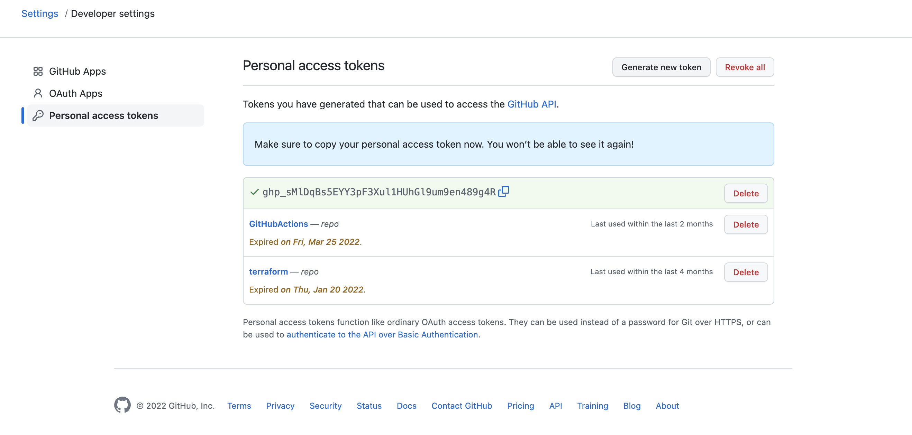
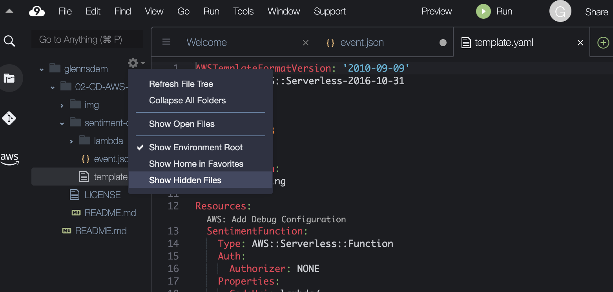

# GitHub actions, AWS Lambda med API Gateway og AWS SAM

I denne øvingen skal vi se på Github actions og hvordan vi kan sette opp en CD pipeline for en AWS Lambdafunksjon. 
Vi skal bruke AWS tjenesten "Comprehend" for å finne "stemningen" (Sentiment) i en tekst- og om den er negativt eller positivt 
ladet. 

Vi skal også se på hvordan vi kan bruke "Feature toggles" med tjenesten Unleash for å slå av/på funkskjonalitet dynamisk 
uten å gjøre nye deployments. 

Deployment og bygg skal gjøres med verktøyet "AWS SAM", både i pipeline med GitHub actions, men også for fra et Cloud9
miljø.

## Lag en fork

Du må start emd å lage en fork av dette repositoryet til din egen GitHub konto.


## Logg i Cloud 9 miljøet ditt 


* Logg på med din AWS bruker med URL, brukernavn og passord gitt i klassrommet
* Gå til tjenesten Cloud9 (Du nå søke på Cloud9 uten mellomrom i søket) 
* Velg "Open IDE" 
* Hvis du ikke ser ditt miljø, kan det hende du har valgt feil region. Hvilken region du skal bruke vil bli oppgitt i klasserommet.

## Rydde plass

Det er bare 10GB med data på den virtuelle serveren Cloud9 miljøet er startet på, så du må slette et par docker images for å rydde
pass 

```shell
 docker image rm lambci/lambda:nodejs10.x
 docker image rm lambci/lambda:nodejs12.x
 docker image rm lambci/lambda:python2.7
```

### Lag et Access Token for GitHub

Når du skal autentisere deg mot din GitHub konto fra Cloud 9 trenger du et access token.  Gå til  https://github.com/settings/tokens og lag et nytt.



Access token må ha "repo" tillatelser, og "workflow" tillatelser.


### Lage en klone av din Fork (av dette repoet) inn i ditt Cloud 9 miljø

Fra Terminal i Cloud 9. Klone repository med HTTPS URL. Eksempel ; 

```
git clone https://github.com/≤github bruker>/02-CD-AWS-lamda-sls
```

Får du denne feilmeldingen ```bash: /02-CD-AWS-lamda-sls: Permission denied``` - så må du huske å bytte ut <github bruker> med 
ditt eget Github brukernavn. 


OBS Når du gjør ```git push``` senere og du skal autentisere deg, skal du bruke GitHub Access token når du blir bedt om passord, 
så du trenger å ta vare på dette et sted. 

For å slippe å autentisere seg hele tiden kan man få git til å cache nøkler i et valgfritt
antall sekunder på denne måten;

```shell
git config --global credential.helper "cache --timeout=86400"
```

Konfigurer også brukernavnet ditt

````shell
git config --global user.name <github brukernavn>
git config --global user.email <email for github bruker>

````

## Test deployment fra Cloud 9

I cloud 9, åpne en Terminal

```shell
cd 02-CD-AWS-lamda-sls
cd sentiment-demo/
sam build --use-container
```

Du kan teste funksjonen uten å deploye den til AWS ved å kjøre kommandoen 

```shell
export UnleashToken=<Token gitt i klasserommet>
sam local invoke -e event.json 
```
Så lenge feature flagget MOCK er satt til "true" vil sentiment-analysen alltid returnere et positivt sentiment. 
AWS Comprehend tjenesten vil bli brukt, når MOCK feature flagget er slått av. 

Event.json filen inneholder en request, nøyaktig slik API Gateway sender den til "handler" metoden/funksjonen. 

Du skal få en respons omtrent som denne 
```
{"statusCode": 200, "headers": {"Content-Type": "application/json"}, "body": "{\"sentiment \": \"{\\\"Sentiment\\\": \\\"NEGATIVE\\\", \\\"SentimentScore\\\": {\\\"Positive\\\": 0.00023614335805177689, \\\"Negative\\\": 0.9974453449249268, \\\"Neutral\\\": 0.00039782875683158636, \\\"Mixed\\\": 0.0019206495489925146}, \\\"ResponseMetadata\\\": {\\\"RequestId\\\": \\\"c3367a61-ee05-4071-82d3-e3aed344f9af\\\", \\\"HTTPStatusCode\\\": 200, \\\"HTTPHeaders\\\": {\\\"x-amzn-requestid\\\": \\\"c3367a61-ee05-4071-82d3-e3aed344f9af\\\", \\\"content-type\\\": \\\"application/x-amz-json-1.1\\\", \\\"content-length\\\": \\\"168\\\", \\\"date\\\": \\\"Mon, 18 Apr 2022 12:00:06 GMT\\\"}, \\\"RetryAttempts\\\": 0}}\"}"}END RequestId: d37e4849-b175-4fa6-aa4b-0031af6f41a0
REPORT RequestId: d37e4849-b175-4fa6-aa4b-0031af6f41a0  Init Duration: 0.42 ms  Duration: 1674.95 ms    Billed Duration: 1675 ms        Memory Size: 128 MB     Max Memory Used: 128 MB
```

* Ta en ekstra kikk på event.json. Dette er objektet AWS Lambda får av tjenesten API Gateway .
* Forsøke å endre teksten i "Body" delen av event.json - klarer å å endre sentimentet til positivt ?

## Deploy med SAM fra Cloud 9

* Du kan også bruke SAM til å deploye lambdafunksjonen rett fra Cloud 9 
* NB! Du må endre Stack name til noe unikt. Legg på ditt brukeranvn eller noe i slutten av navnet, for eksempel; ```--stack-name sam-sentiment-ola```

```shell
 sam deploy --no-confirm-changeset --no-fail-on-empty-changeset --stack-name sam-sentiment-gb3 --s3-bucket lambda-deployments-gb --capabilities CAPABILITY_IAM --region us-east-1  --parameter-overrides "ParameterKey=UnleashToken,ParameterValue=1234"
```

Du kan deretter bruke for eksempel postman eller Curl til å teste ut tjenesten. <URL> får dere etter SAM deploy. 

```shell
curl -X POST \
  <URL> \
  -H 'Content-Type: text/plain' \
  -H 'cache-control: no-cache' \
  -d 'The laptop would not boot up when I got it. It would let me get through a few steps of the setup process, then it would become unresponsive and eventually shut down, then restar, '
```

Men... dette er jo ikke veldig "DevOps" og vil ikke fungere i et større team. Vi trenger både CI og CD for å kunne jobbe 
effektivt sammen om denne funksjonen.

## GitHub Actions

* For å få se filer som er "skjulte" i AWS Cloud9 må du velge "show hidden files" i fil-utforskeren.


* Kopier denne koden inn i  ```.github/workflows/``` katalogen, og kall den for eksempel sam-deploy.yml eller noe tilsvarende.
* Du må endre parameter ````--stack-name``` til ```sam deploy``` kommandoen. Bruk samme stack navn som du brukte når du deployet direkte fra cloud 9-

```yaml
on:
  push:
    branches:
      - main

defaults:
  run:
    working-directory: ./sentiment-demo

jobs:
  build-deploy:
    runs-on: ubuntu-latest
    steps:
      - uses: actions/checkout@v2
      - uses: actions/setup-python@v2
      - uses: aws-actions/setup-sam@v1
      - uses: aws-actions/configure-aws-credentials@v1
        with:
          aws-access-key-id: ${{ secrets.AWS_ACCESS_KEY_ID }}
          aws-secret-access-key: ${{ secrets.AWS_SECRET_ACCESS_KEY }}
          aws-region: us-east-1
      - run: sam build --use-container
      - run: sam deploy --no-confirm-changeset --no-fail-on-empty-changeset --stack-name sam-sentiment-<your name or something> --s3-bucket lambda-deployments-gb --capabilities CAPABILITY_IAM --region us-east-1  --parameter-overrides "ParameterKey=UnleashToken,ParameterValue=${{ secrets.UNLEASH_TOKEN }}"
 ```

For å pushe endringen til ditt repo må du stå i riktig katalog i Cloud9 terminalen 

```bash
cd ~/environment/02-CD-AWS-lamda-sls
git add .github/
git commit -m"added workflow file" 
git push 
```

På git push blir du bedt om brukernavn og passord. Bruk brukernavnet ditt, og Access Token du laget tidligere som passord.

## Hemmeligheter


Vi skal _absolutt ikke_ sjekke inn API nøkler og hemmeligheter inn i koden. GitHub har heldigvis en mekanisme for å lagre hemmeligheter utenfor koden. 
Repository settings og under menyvalget "secrets" kan vi legge inn verdier og bruke de fra workflowene våre ved å referere de ved navn for eksempel på denne måten
``` aws-access-key-id: ${{ secrets.AWS_ACCESS_KEY_ID }}```

Lag tre repository secrets, verdiene postes på Slack i klasserommet. 

* AWS_ACCESS_KEY_ID 
* AWS_SECRET_ACCESS_KEY
* UNLEASH_TOKEN 

## Sjekk at pipeline virker

* Gjør kode-endringer på main branch i lambda - koden, push. Se at pipeline deployer endringen din 

* Test lambdafunksjonen med feks Curl (eller Postman om du har) 
```shell
curl -X POST \
  <URL> \
  -H 'Content-Type: text/plain' \
  -H 'cache-control: no-cache' \
  -d 'The laptop would not boot up when I got it. It would let me get through a few steps of the setup process, then it would become unresponsive and eventually shut down, then restar, '
```

## Bonus utfordringer 

* Kan dere bruke en Egen Unleash konto og egen feature toggle? 
* Repetisjon fra forrige øving; Klarer du å endre  workflowen til å kjøre på Pull requester mot main, og konfigurere branch protection på ```main``` branch så vi ikke kan pushe direkte dit?.
 